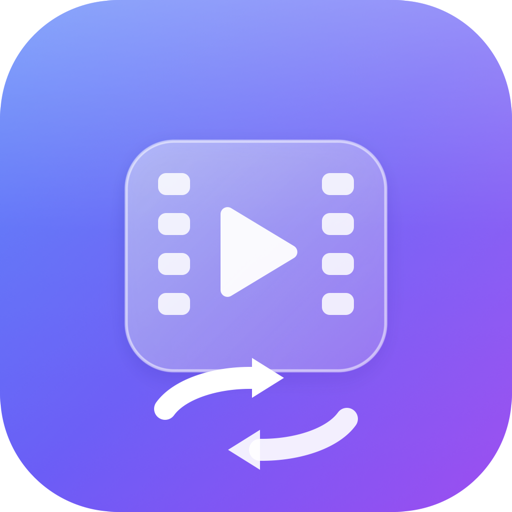

<div align="center">
  
  <h1>CapShare</h1>
  <p><strong>Share CapCut projects between machines — Mac ↔ Mac, Windows ↔ Windows, and Mac ↔ Windows.</strong></p>
</div>

CapCut desktop has no built-in way to move a project to another computer. CapShare packs a project — timeline, media, effect assets — into a single portable **`.capshare`** file, and imports it on the other machine so it shows up in CapCut's drafts list and just plays.

- 🖥️ **Cross-platform**: macOS and Windows, in any direction
- 📦 **Self-contained**: media, effect caches and metadata travel in one file
- 🪶 **Lean by default**: regenerable AI caches (matting, smart-crop, audio analysis) are skipped — a 97 MB project exports as ~35 MB; toggle "Include AI caches" for byte-exact copies
- 🔍 **Project previews**: covers, duration, resolution and a mini-timeline before you export or import
- 🛡️ **Safe by design**: staged imports with atomic renames, automatic backups, never destructive
- 🧊 macOS 26 _Liquid Glass_-style UI on both platforms

## Install

Builds are unsigned (no Apple/Microsoft certificates), so the OS will warn on first launch:

**macOS** (`CapShare-x.y.z.dmg`)

1. Open the DMG and drag CapShare to Applications.
2. First launch: **right-click → Open → Open** (or allow it under System Settings → Privacy & Security).
   If macOS says the app "is damaged", clear the quarantine flag once:
   `xattr -dr com.apple.quarantine /Applications/CapShare.app`

**Windows** (`capshare-x.y.z-setup.exe`)

1. Run the installer. If SmartScreen appears: **More info → Run anyway**.
2. The installer registers `.capshare` files so double-clicking them opens CapShare.
   (The portable `.exe` works too, but can't register the file association.)

## Use

1. **Export** — open CapShare → _Projects_ → pick a project → **Export .capshare**.
2. Send the file to the other machine (drive, AirDrop, cloud, …).
3. **Import** — double-click the `.capshare` file (or drag it into CapShare) → **Import project** → restart CapCut.

If a project with the same name already exists you choose: **import as copy** (both kept) or **replace** (the old version is backed up outside CapCut first).

## What survives the move — and what can't

|                                                                     |                                                                                                                                 |
| ------------------------------------------------------------------- | ------------------------------------------------------------------------------------------------------------------------------- |
| ✅ Timeline, cuts, transitions, effects, stickers, text, animations | Fully preserved                                                                                                                 |
| ✅ All imported media                                               | Bundled in the file                                                                                                             |
| ✅ Downloaded effect assets                                         | Bundled; restored into the target machine's cache                                                                               |
| ⚠️ Fonts                                                            | Fonts are installed per-OS. CapCut-library fonts re-download; system fonts missing on the target fall back (CapShare warns you) |
| ⚠️ Region/account-gated effects                                     | May need to re-download when online, and only if the account/region allows them                                                 |
| ⚠️ Much newer source CapCut                                         | An older CapCut may refuse a draft from a much newer version ("created by a newer version") — update CapCut on the target       |

## How it works

CapCut stores each project as a _draft folder_ (`draft_info.json` / `draft_content.json` timeline + media in `Resources/local/`) under:

- macOS: `~/Movies/CapCut/User Data/Projects/com.lveditor.draft/`
- Windows: `%LOCALAPPDATA%\CapCut\User Data\Projects\com.lveditor.draft\`

A `.capshare` file is a ZIP64 archive: the draft folder, a manifest, any media that lived _outside_ the project folder, and the machine-specific effect-cache assets. On import CapShare:

1. stages everything in a temp folder (the import either fully completes or leaves no trace),
2. rewrites machine-specific absolute paths (effect caches, loose media) to the target machine's layout — media references use CapCut's own portable placeholder format,
3. replaces the `platform` identity blocks with the target machine's (this is what prevents CapCut's "project is from an unusual path" error),
4. writes the timeline filename the target CapCut generation expects (`draft_info.json` on modern macOS, `draft_content.json` on Windows — probed from your existing drafts),
5. atomically moves the project into the drafts folder and registers it in CapCut's `root_meta_info.json` (with a backup; CapCut's own folder scan is the fallback).

Only CapCut **International** drafts are supported (JianYing 6+ encrypts its project files).

## Development

```bash
pnpm install
pnpm dev             # hot-reloading dev app
pnpm test            # core-logic unit tests (Vitest)
pnpm typecheck
pnpm lint
pnpm build:mac       # dmg + zip (universal)
pnpm build:win       # nsis installer + portable
```

Architecture: `src/main/core/` is pure Node (no Electron imports) and contains everything that touches CapCut's format — locator, draft parser, path scanner/classifier, export/import pipelines, registry handling. The IPC layer (`src/main/ipc.ts`) is a thin zod-validated shell; the renderer is React 19 + Tailwind v4 + shadcn/ui.

A gated end-to-end test exports a **real** draft from this machine's CapCut and imports it back as a copy:

```bash
CAPSHARE_REAL_E2E=1 pnpm exec vitest run tests/real-draft.e2e.test.ts
```

## License

MIT
